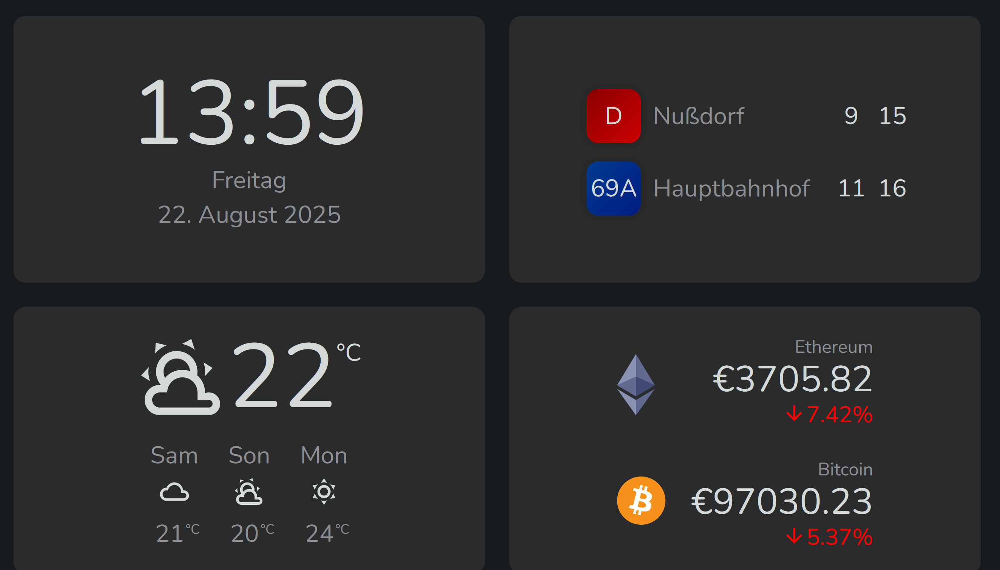

# Raspi Dashboard

A customizable dashboard designed for Raspberry Pi or similar devices. It provides a clean and minimal interface to display essential daily information at a glance, including:

- Current time and date
- Weather updates with temperature and conditions
- Wiener Linien public transport departures to keep track of nearby connections
- Cryptocurrency statistics with real-time price updates

To protect your display, the dashboard includes an anti-burn mechanism that shifts colors around the screen over time, reducing the risk of screen burn-in on always-on setups.

Optimized for continuous use, it’s perfect as a smart desk or wall-mounted information hub.

### Development

- Add your OpenWeather and CoinStats API keys to `.env`
- Add station name and displayed lines in `departuresConfig.ts`
- Run `npm run start`.

